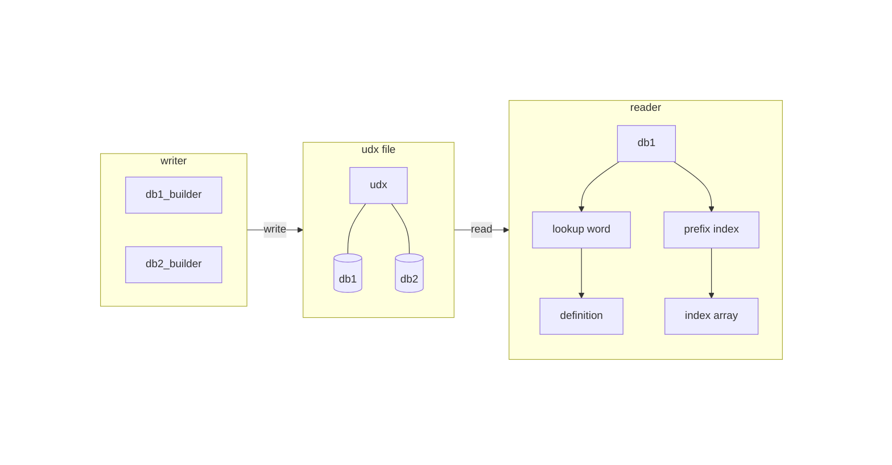

# libudx

[](https://opensource.org/licenses/MIT)
[](https://en.wikipedia.org/wiki/C11_(C_standard))
[](https://github.com/kejinlu/libudx/actions/workflows/ci.yml)

**libudx** — A fast, minimal C library for reading and writing **[UDX (Universal Dictionary eXchange)](docs/format.md)** file.



## Use As

- **Standalone Dictionary** — Create self-contained dictionary files with embedded data and indexing. Multi-database support enables storing dictionary definitions enriched with images, audio, and other multimedia content in a single file.
- **Indexing Engine** — Provide fast custom B+ tree indexing for existing dictionaries in various formats.

## Building

### Prerequisites

- C compiler with C11 support
- zlib library 1.2.12+
- CMake 3.14+ or direct compilation

### Install Dependencies

**macOS:**
zlib is included with Xcode Command Line Tools. Install if needed:
```bash
xcode-select --install
```

**Ubuntu/Debian:**
```bash
sudo apt-get install zlib1g-dev
```

**Fedora/RHEL:**
```bash
sudo dnf install zlib-devel
```

**Windows:**
Install zlib using [vcpkg](https://vcpkg.io/):
```cmd
vcpkg install zlib:x64-windows
```

Then configure CMake with the vcpkg toolchain:
```cmd
cmake -B build -DCMAKE_TOOLCHAIN_FILE=C:/vcpkg/scripts/buildsystems/vcpkg.cmake
```

### Build from Source

```bash
# Clone the repository
git clone https://github.com/kejinlu/libudx.git
cd libudx

# Configure with CMake (requires CMake 3.14 or later)
mkdir build && cd build
cmake ..

# Build
cmake --build .

# Run tests (optional)
ctest --output-on-failure

# Install (optional, installs to system default location)
sudo cmake --install
```

#### CMake Options

| Option | Default | Description |
|--------|---------|-------------|
| `UDX_BUILD_TESTS` | `ON` | Build test suite |
| `UDX_BUILD_EXAMPLES` | `ON` | Build example programs |
| `BUILD_SHARED_LIBS` | `OFF` | Build shared library instead of static |

**Example: Disable tests and build shared library**
```bash
cmake -DUDX_BUILD_TESTS=OFF -DBUILD_SHARED_LIBS=ON ..
```

### Compile Directly (Without CMake)

```bash
gcc -o myprogram myprogram.c -I./src -L./build -ludx -lz
```

## Quick Start

### Writing a Dictionary File

```c
#include "udx_writer.h"

int main() {
    // Open a new UDX file for writing
    udx_writer *writer = udx_writer_open("mydict.udx");
    if (!writer) {
        fprintf(stderr, "Failed to create writer\n");
        return 1;
    }

    // Create a database builder with optional metadata
    const char *metadata = "Created by libudx";
    udx_db_builder *builder = udx_db_builder_create_with_metadata(
        writer, "english", (const uint8_t *)metadata, strlen(metadata)
    );

    // Add entries
    udx_db_builder_add_entry(builder, "hello", (const uint8_t *)data1, size1);
    udx_db_builder_add_entry(builder, "world", (const uint8_t *)data2, size2);

    // Finish building the database
    udx_db_builder_finalize(builder);

    // Close the writer
    udx_writer_close(writer);
    return 0;
}
```

### Reading a Dictionary File

```c
#include "udx_reader.h"

int main() {
    // Open a UDX file
    udx_reader *reader = udx_reader_open("mydict.udx");
    if (!reader) {
        fprintf(stderr, "Failed to open file\n");
        return 1;
    }

    // Open a database by name (or use NULL for first database)
    udx_db *db = udx_db_open(reader, "english");
    if (!db) {
        fprintf(stderr, "Database not found\n");
        udx_reader_close(reader);
        return 1;
    }

    // Look up a word
    udx_db_entry *entry = udx_db_lookup(db, "hello");
    if (entry) {
        printf("Found: %s\n", entry->word);
        for (size_t i = 0; i < entry->items.size; i++) {
            printf("  Data[%zu]: %zu bytes\n", i, entry->items.data[i].size);
        }
        udx_db_entry_free(entry);
    }

    // Cleanup
    udx_db_close(db);
    udx_reader_close(reader);
    return 0;
}
```

### Prefix Matching

```c
// Find all words starting with "hel"
udx_index_entry_array results = udx_db_index_prefix_match(db, "hel", 100);

for (size_t i = 0; i < results.size; i++) {
    printf("Word: %s (%zu items)\n",
           results.data[i].word,
           results.data[i].items.size);
}

// Free results
udx_index_entry_array_free_contents(&results);
```

### Iteration

```c
udx_db_iter *iter = udx_db_iter_create(db);
const udx_db_entry *entry;

while ((entry = udx_db_iter_next(iter)) != NULL) {
    printf("%s\n", entry->word);
}

udx_db_iter_destroy(iter);
```

## Performance

| Operation | Complexity |
|-----------|------------|
| Exact lookup | O(log n) |
| Prefix match | O(log n + k) |
| Insertion | O(log n) |
| Iteration | O(n) |

*Benchmarks on a dictionary with 1 million entries:*

- Lookup: ~0.5μs per query
- Prefix match: ~1μs per query
- File size: ~40% smaller than uncompressed

## Thread Safety

libudx is **not thread-safe** by design. For concurrent access:

**Option 1: Separate reader per thread (recommended)**
```c
// Thread 1
udx_reader *r1 = udx_reader_open("dict.udx");
udx_db *db1 = udx_db_open(r1, "english");
udx_db_lookup(db1, "hello");

// Thread 2
udx_reader *r2 = udx_reader_open("dict.udx");
udx_db *db2 = udx_db_open(r2, "english");
udx_db_lookup(db2, "world");
```

**Option 2: Shared reader with external lock**
```c
pthread_mutex_t reader_lock = PTHREAD_MUTEX_INITIALIZER;

// Any thread - lock reader before any operations
pthread_mutex_lock(&reader_lock);
udx_db *db = udx_db_open(reader, "english");
pthread_mutex_unlock(&reader_lock);

pthread_mutex_lock(&reader_lock);
udx_db_lookup(db, "hello");
pthread_mutex_unlock(&reader_lock);
```

## Platform Support

- **Linux** ✅ (tested)
- **macOS** ✅ (tested)
- **Windows** ✅ (MSVC/MinGW, 64-bit file offsets supported)

## Contributing

Contributions are welcome! Please:

1. Fork the repository
2. Create a feature branch (`git checkout -b feature/amazing-feature`)
3. Commit your changes (`git commit -m 'Add amazing feature'`)
4. Push to the branch (`git push origin feature/amazing-feature`)
5. Open a Pull Request

## License

```
MIT License

Copyright (c) 2026 kejinlu <kejinlu@gmail.com> (libudx project)

Permission is hereby granted, free of charge, to any person obtaining a copy
of this software and associated documentation files (the "Software"), to deal
in the Software without restriction, including without limitation the rights
to use, copy, modify, merge, publish, distribute, sublicense, and/or sell
copies of the Software, and to permit persons to whom the Software is
furnished to do so, subject to the following conditions:

The above copyright notice and this permission notice shall be included in all
copies or substantial portions of the Software.

THE SOFTWARE IS PROVIDED "AS IS", WITHOUT WARRANTY OF ANY KIND, EXPRESS OR
IMPLIED, INCLUDING BUT NOT LIMITED TO THE WARRANTIES OF MERCHANTABILITY,
FITNESS FOR A PARTICULAR PURPOSE AND NONINFRINGEMENT. IN NO EVENT SHALL THE
AUTHORS OR COPYRIGHT HOLDERS BE LIABLE FOR ANY CLAIM, DAMAGES OR OTHER
LIABILITY, WHETHER IN AN ACTION OF CONTRACT, TORT OR OTHERWISE, ARISING FROM,
OUT OF OR IN CONNECTION WITH THE SOFTWARE OR THE USE OR OTHER DEALINGS IN THE
SOFTWARE.
```

## Acknowledgments

libudx incorporates the following third-party components:

- **[B-tree implementation](https://github.com/tidwall/btree)** by Joshua J Baker (MIT License)
- **[zlib](https://zlib.net/)** by Jean-loup Gailly and Mark Adler (zlib License)

## References

- [B+ Tree - Wikipedia](https://en.wikipedia.org/wiki/B%2B_tree) - Standard B+ tree structure with internal nodes for navigation and leaf nodes for data storage

## See Also

- [UDX Format Specification](docs/format.md)
- [API Documentation](docs/api.md)
- [Architecture & Design Decisions](docs/architecture.md)
